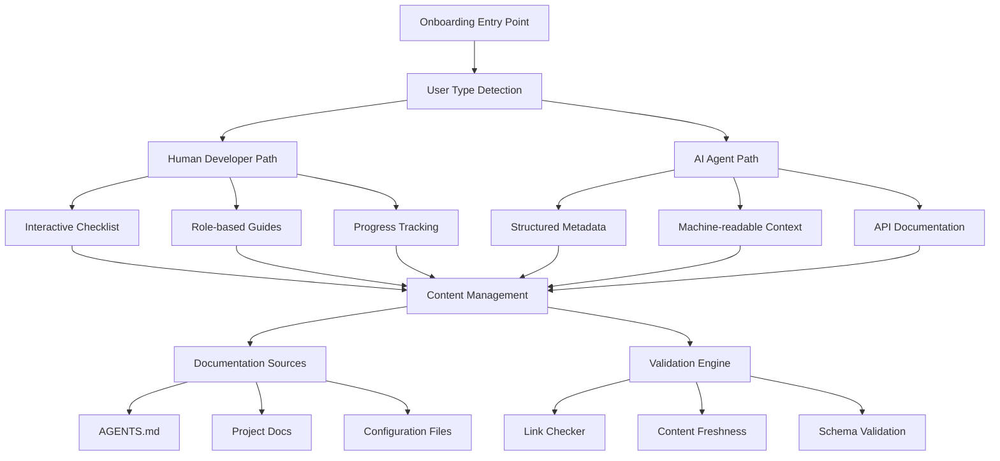
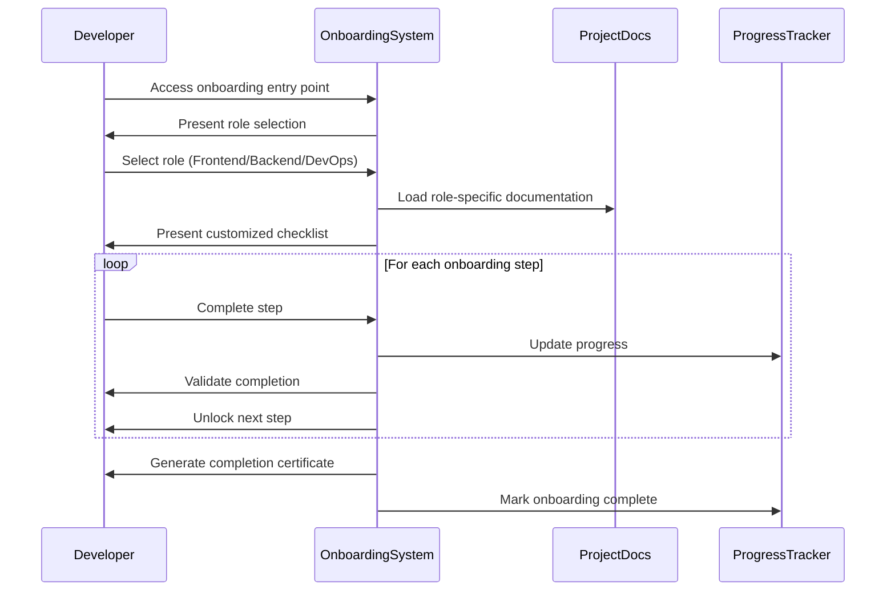
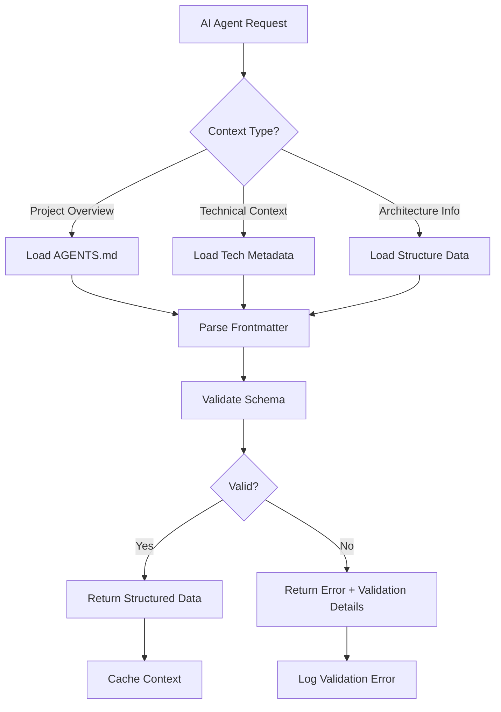
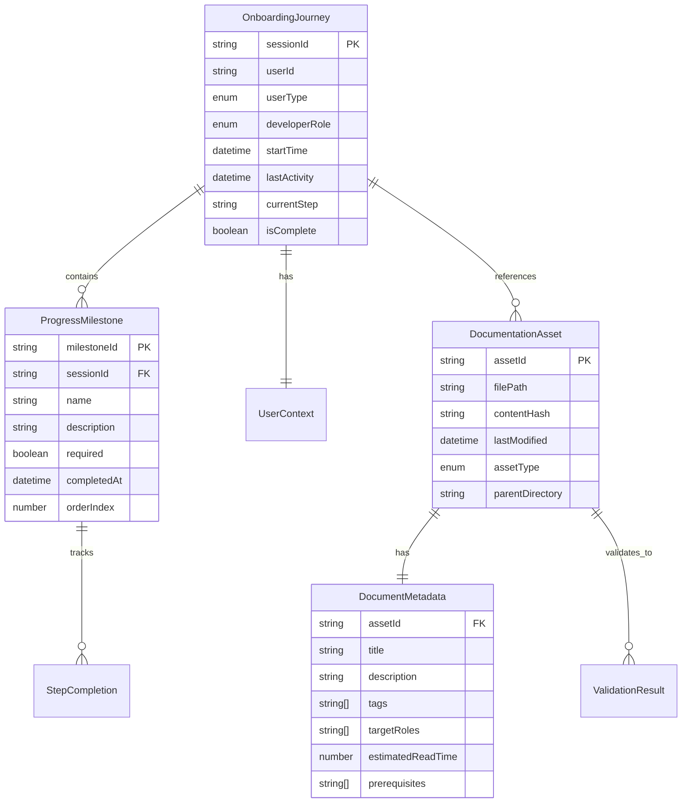
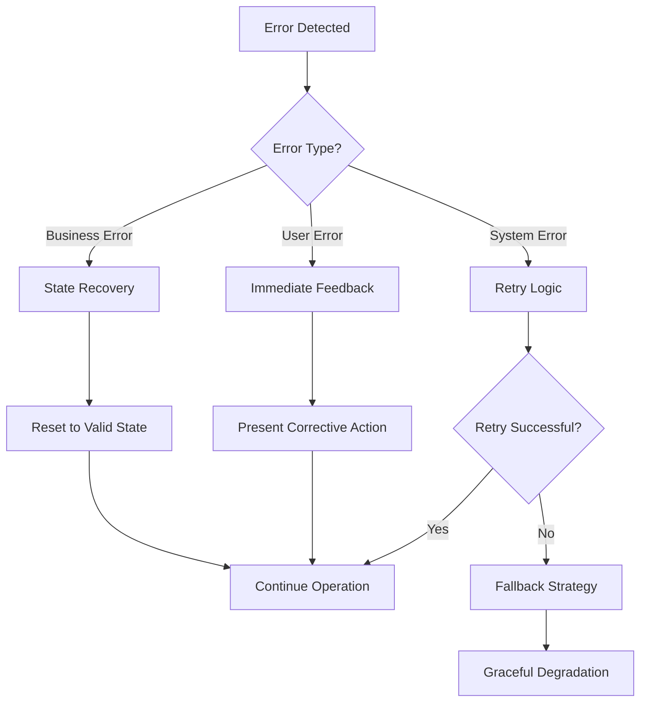
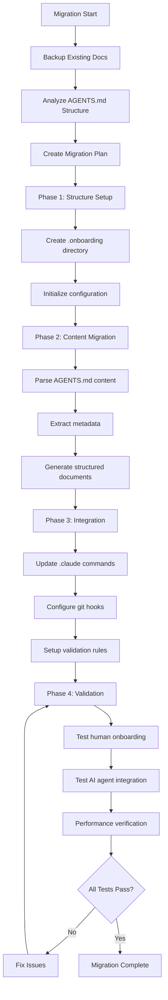

# Technical Design Document

## Overview

The Project Onboarding System provides a standardized, markdown-based framework to efficiently guide both human developers and AI agents through project familiarization. This system addresses the critical need for structured onboarding in modern software development, where 70% of teams report that well-crafted documentation reduces onboarding time by 25%.

**Purpose**: This feature delivers comprehensive onboarding automation to development teams and AI coding agents.

**Users**: New developers, AI agents (like Claude Code), and project maintainers will utilize this for streamlined project integration, context understanding, and documentation maintenance.

**Impact**: Transforms the current ad-hoc documentation approach by creating a systematic, machine-readable onboarding framework that integrates existing documentation patterns while introducing modern best practices aligned with 2025 standards.

### Goals

- Reduce new developer onboarding time by 25% through structured documentation workflows
- Enable AI agents to quickly understand project context through machine-readable metadata
- Consolidate and enhance existing documentation (AGENTS.md) into a comprehensive onboarding framework
- Create interactive onboarding experiences with progress tracking and role-based customization

### Non-Goals

- Replacing existing development workflows or tools
- Creating a separate application or standalone service
- Migrating away from Markdown as the primary documentation format
- Implementing real-time collaboration features (future consideration)

## Architecture

### Existing Architecture Analysis

The project currently has well-established documentation patterns that must be preserved and enhanced:

- **AGENTS.md**: Comprehensive project guidance for AI agents (formerly CLAUDE.md)
- **.claude/ directory**: Claude Code commands and local settings
- **Existing documentation**: README.md, upgrade plans, asset processing documentation
- **Technology stack**: TypeScript, Node.js 20, Express.js, Angular, MongoDB

The onboarding system will extend these patterns rather than replace them, following the project's principle of preferring editing existing files over creating new ones.

### High-Level Architecture



### Technology Alignment

The onboarding system aligns with the existing technology stack:

- **Core Language**: TypeScript (consistent with project standard)
- **Runtime**: Node.js 20 (matching current project version)
- **Documentation Format**: Markdown with structured frontmatter (extending current approach)
- **Integration**: Leverages existing .claude directory structure
- **Storage**: File-system based (no additional database requirements)

**New Dependencies Introduced**:
- `gray-matter`: YAML frontmatter parsing for structured metadata
- `markdown-it`: Enhanced Markdown parsing with plugin support
- `ajv`: JSON schema validation for metadata structure

### Key Design Decisions

**Decision**: File-system based architecture with structured Markdown files
**Context**: Need to maintain simplicity while adding structure for both human and machine consumption
**Alternatives**: 
1. Database-driven system with web interface
2. External documentation platform integration
3. Custom binary format for efficiency
**Selected Approach**: Enhanced Markdown files with YAML frontmatter in existing directory structure
**Rationale**: Preserves git-based workflow, requires no additional infrastructure, maintains human readability while adding machine-readable structure
**Trade-offs**: Gain simplicity and maintainability; sacrifice real-time features and advanced querying capabilities

**Decision**: Dual-format documentation strategy (human + machine-readable)
**Context**: Requirements specify serving both human developers and AI agents effectively
**Alternatives**:
1. Single format optimized for humans with AI parsing
2. Separate documentation sets for each audience
3. Dynamic generation from single source
**Selected Approach**: Unified Markdown with structured metadata sections and machine-readable annotations
**Rationale**: Aligns with emerging AGENTS.md standard (adopted by 20,000+ projects), reduces maintenance overhead, ensures consistency
**Trade-offs**: Gain unified source of truth and reduced duplication; sacrifice some specialization for each audience

## System Flows

### Human Developer Onboarding Flow



### AI Agent Context Loading Flow



## Requirements Traceability

| Requirement | Component | Interface | Implementation |
|-------------|-----------|-----------|----------------|
| 1.1 - Documentation Structure | DocumentationManager | generateTemplate() | Creates predefined directory structure with templates |
| 1.2 - Template Generation | TemplateEngine | createTemplate() | Generates placeholder content with required sections |
| 2.1 - Human Onboarding Path | OnboardingOrchestrator | startHumanOnboarding() | Presents progressive checklist interface |
| 3.1 - AI Agent Context | MetadataProvider | getProjectContext() | Returns structured JSON metadata |
| 4.1 - Interactive Workflows | ProgressTracker | trackCompletion() | Manages user state and progression |
| 5.1 - Content Validation | ValidationEngine | validateDocumentation() | Checks links, freshness, schema compliance |
| 6.1 - Tool Integration | IntegrationManager | syncWithTools() | Connects with version control and CI/CD |

## Components and Interfaces

### Core System Components

#### OnboardingOrchestrator

**Responsibility & Boundaries**
- **Primary Responsibility**: Coordinates the entire onboarding experience for both humans and AI agents
- **Domain Boundary**: Onboarding workflow management and user experience
- **Data Ownership**: User progress state and onboarding configuration
- **Transaction Boundary**: Single onboarding session lifecycle

**Dependencies**
- **Inbound**: CLI commands, web interface requests, API calls
- **Outbound**: DocumentationManager, ProgressTracker, MetadataProvider
- **External**: Git repository for version information

**Contract Definition**

```typescript
interface OnboardingOrchestratorService {
  startOnboarding(userType: UserType, role?: DeveloperRole): Result<OnboardingSession, OnboardingError>;
  getProgress(sessionId: string): Result<ProgressState, NotFoundError>;
  completeStep(sessionId: string, stepId: string): Result<StepCompletion, ValidationError>;
  generateCertificate(sessionId: string): Result<CompletionCertificate, IncompleteError>;
}

enum UserType {
  HUMAN_DEVELOPER = 'human',
  AI_AGENT = 'agent'
}

enum DeveloperRole {
  FRONTEND = 'frontend',
  BACKEND = 'backend',
  DEVOPS = 'devops',
  FULLSTACK = 'fullstack'
}
```

#### DocumentationManager

**Responsibility & Boundaries**
- **Primary Responsibility**: Manages documentation structure, templates, and content generation
- **Domain Boundary**: Documentation file system operations and template management
- **Data Ownership**: Documentation templates, file structure definitions, content validation rules

**Dependencies**
- **Inbound**: OnboardingOrchestrator, ValidationEngine
- **Outbound**: File system, TemplateEngine, ContentParser
- **External**: Git for file versioning, existing documentation files

**Contract Definition**

```typescript
interface DocumentationManagerService {
  initializeStructure(projectPath: string): Result<StructureCreated, FileSystemError>;
  generateTemplate(templateType: TemplateType, context: ProjectContext): Result<TemplateContent, GenerationError>;
  validateStructure(projectPath: string): Result<ValidationReport, ValidationError>;
  migrateExistingDocs(sourcePath: string, targetStructure: DocumentationStructure): Result<MigrationReport, MigrationError>;
}

interface TemplateContent {
  filePath: string;
  content: string;
  metadata: DocumentMetadata;
}
```

#### MetadataProvider

**Responsibility & Boundaries**
- **Primary Responsibility**: Provides structured, machine-readable project context for AI agents
- **Domain Boundary**: Metadata extraction, schema validation, and structured data serving
- **Data Ownership**: Structured project metadata, schema definitions, API documentation

**Dependencies**
- **Inbound**: AI agent requests, OnboardingOrchestrator
- **Outbound**: DocumentationManager, SchemaValidator
- **External**: Package.json, TypeScript configuration, Git repository metadata

**Contract Definition**

```typescript
interface MetadataProviderService {
  getProjectContext(): Result<ProjectMetadata, MetadataError>;
  getArchitectureInfo(): Result<ArchitectureMetadata, MetadataError>;
  getDependencyMap(): Result<DependencyGraph, MetadataError>;
  validateSchema(metadata: any): Result<SchemaValidation, SchemaError>;
}

interface ProjectMetadata {
  name: string;
  description: string;
  version: string;
  technologies: TechnologyStack;
  architecture: ArchitecturePattern;
  conventions: CodingStandards;
  lastUpdated: string;
}
```

#### ProgressTracker

**Responsibility & Boundaries**
- **Primary Responsibility**: Tracks user progress through onboarding workflows and manages state persistence
- **Domain Boundary**: Progress state management and completion validation
- **Data Ownership**: User progress data, completion timestamps, achievement records

**Dependencies**
- **Inbound**: OnboardingOrchestrator, user interface components
- **Outbound**: File system for persistence, ValidationEngine
- **External**: None (self-contained state management)

**Contract Definition**

```typescript
interface ProgressTrackerService {
  createSession(userId: string, onboardingType: OnboardingType): Result<SessionId, CreationError>;
  updateProgress(sessionId: string, stepId: string, status: StepStatus): Result<ProgressUpdate, UpdateError>;
  getSessionState(sessionId: string): Result<SessionState, NotFoundError>;
  generateReport(sessionId: string): Result<ProgressReport, ReportError>;
}

interface SessionState {
  sessionId: string;
  userId: string;
  onboardingType: OnboardingType;
  currentStep: string;
  completedSteps: string[];
  startTime: Date;
  lastActivity: Date;
  estimatedCompletion: Date;
}
```

### Integration Components

#### ValidationEngine

**Responsibility & Boundaries**
- **Primary Responsibility**: Validates documentation content, links, and schema compliance
- **Domain Boundary**: Content quality assurance and compliance checking
- **Data Ownership**: Validation rules, link check results, compliance reports

**Dependencies**
- **Inbound**: DocumentationManager, CI/CD integration triggers
- **Outbound**: HTTP client for link checking, file system for content access
- **External**: External URLs for link validation, schema definition repositories

**External Dependencies Investigation**:
- **Link Validation**: Using `node-html-parser` and `axios` for HTTP link checking
- **Schema Validation**: `ajv` (JSON Schema validator) - industry standard with TypeScript support
- **Markdown Processing**: `markdown-it` with plugins for enhanced parsing capabilities
- **YAML Processing**: `yaml` package for frontmatter parsing

**Contract Definition**

```typescript
interface ValidationEngineService {
  validateContent(filePath: string): Result<ContentValidation, ValidationError>;
  checkLinks(documentation: DocumentationSet): Result<LinkCheckReport, LinkCheckError>;
  validateSchema(content: any, schemaId: string): Result<SchemaValidation, SchemaError>;
  generateReport(projectPath: string): Result<ValidationReport, ReportError>;
}

interface LinkCheckReport {
  totalLinks: number;
  validLinks: number;
  brokenLinks: BrokenLink[];
  checkTimestamp: Date;
}
```

#### IntegrationManager

**Responsibility & Boundaries**
- **Primary Responsibility**: Integrates onboarding system with existing development tools and workflows
- **Domain Boundary**: External tool connectivity and workflow automation
- **Data Ownership**: Integration configurations, sync status, webhook handlers

**Dependencies**
- **Inbound**: CI/CD webhooks, git hooks, command-line interfaces
- **Outbound**: Git API, CI/CD platforms, project management tools
- **External**: GitHub API, GitLab API, Jenkins, npm registry

**Contract Definition**

```typescript
interface IntegrationManagerService {
  syncWithVersionControl(repositoryUrl: string): Result<SyncStatus, SyncError>;
  registerWebhooks(events: WebhookEvent[]): Result<WebhookRegistration, WebhookError>;
  updateFromCI(buildInfo: BuildInformation): Result<UpdateStatus, UpdateError>;
  exportMetrics(timeRange: TimeRange): Result<OnboardingMetrics, MetricsError>;
}

interface OnboardingMetrics {
  totalOnboardings: number;
  averageCompletionTime: number;
  successRate: number;
  commonBlockingPoints: string[];
  roleBreakdown: Map<DeveloperRole, number>;
}
```

## Data Models

### Domain Model

**Core Concepts**:

- **OnboardingJourney**: The complete experience of familiarizing with a project, encapsulating user state, progress, and customization
- **DocumentationAsset**: Any piece of content that contributes to project understanding (markdown files, code examples, configuration files)
- **ProgressMilestone**: Significant checkpoints in the onboarding process that mark completion of major learning objectives
- **UserContext**: The role, experience level, and preferences that shape the onboarding experience

**Business Rules & Invariants**:
- An onboarding journey cannot be marked complete unless all required milestones are achieved
- Documentation assets must have valid metadata and pass content validation before inclusion
- User progress can only advance forward, but users can revisit completed sections
- AI agent contexts must always include valid schema-compliant metadata

### Logical Data Model



### Physical Data Model

**File System Structure**:
```
.onboarding/
├── config/
│   ├── schema.json                 # JSON Schema definitions
│   ├── templates/                  # Template definitions
│   └── validation-rules.json       # Content validation rules
├── data/
│   ├── sessions/                   # User session data (JSON files)
│   ├── progress/                   # Progress tracking (JSON files)
│   └── cache/                      # Cached validation results
└── content/
    ├── human/                      # Human-optimized documentation
    │   ├── frontend-guide.md
    │   ├── backend-guide.md
    │   └── devops-guide.md
    ├── agents/                     # AI agent contexts
    │   ├── project-context.json
    │   ├── architecture.json
    │   └── api-documentation.json
    └── shared/                     # Common resources
        ├── glossary.md
        ├── troubleshooting.md
        └── resources.md
```

**Session Data Schema**:
```json
{
  "sessionId": "uuid",
  "userId": "string",
  "userType": "human|agent",
  "developerRole": "frontend|backend|devops|fullstack",
  "startTime": "iso-datetime",
  "lastActivity": "iso-datetime",
  "currentStep": "string",
  "completedSteps": ["string"],
  "customizations": {
    "preferredLanguage": "string",
    "experienceLevel": "beginner|intermediate|advanced",
    "focusAreas": ["string"]
  },
  "progress": {
    "totalSteps": "number",
    "completedCount": "number",
    "estimatedTimeRemaining": "number"
  }
}
```

### Data Contracts & Integration

**API Data Transfer**:
```typescript
interface OnboardingStartRequest {
  userType: 'human' | 'agent';
  role?: 'frontend' | 'backend' | 'devops' | 'fullstack';
  experienceLevel?: 'beginner' | 'intermediate' | 'advanced';
  preferredLanguage?: string;
}

interface ProjectContextResponse {
  metadata: ProjectMetadata;
  architecture: ArchitectureInfo;
  technologies: TechnologyStack;
  conventions: CodingStandards;
  lastUpdated: string;
  schemaVersion: string;
}
```

**Event Schemas**:
```typescript
interface OnboardingProgressEvent {
  type: 'onboarding.progress.updated';
  sessionId: string;
  stepId: string;
  status: 'started' | 'completed' | 'skipped';
  timestamp: string;
  userId: string;
}

interface DocumentationUpdatedEvent {
  type: 'documentation.updated';
  filePath: string;
  changeType: 'created' | 'modified' | 'deleted';
  affectedSections: string[];
  timestamp: string;
}
```

## Error Handling

### Error Strategy

The onboarding system implements layered error handling with graceful degradation:

1. **Input Validation**: Immediate feedback for user errors with corrective guidance
2. **Content Validation**: Proactive detection of documentation issues with automated fixes where possible
3. **System Resilience**: Fallback strategies for infrastructure failures and service unavailability
4. **Recovery Mechanisms**: State preservation and session recovery for interrupted onboarding

### Error Categories and Responses

**User Errors (4xx equivalent)**:
- Invalid role selection → Present available roles with descriptions
- Incomplete required fields → Highlight missing fields with examples
- Permission denied → Guide to access request process

**System Errors (5xx equivalent)**:
- File system access failure → Retry with exponential backoff, fallback to cached content
- External service timeout → Circuit breaker pattern, graceful degradation
- Memory exhaustion → Cleanup temporary data, request smaller chunks

**Business Logic Errors**:
- Invalid onboarding state → Reset to last valid checkpoint with explanation
- Missing prerequisites → Generate prerequisite checklist and guidance
- Conflicting configurations → Present conflict resolution options

**Error Recovery Flow**:


### Monitoring

**Error Tracking**:
- Structured logging with correlation IDs for session tracking
- Error categorization and trend analysis for proactive improvement
- Performance monitoring for onboarding completion times and success rates

**Health Monitoring**:
- Documentation freshness checks with automated alerts
- Link validation results with broken link reports
- System resource usage and performance metrics

## Testing Strategy

### Unit Tests
- **MetadataProvider**: Schema validation, project context extraction, dependency mapping
- **DocumentationManager**: Template generation, file structure creation, content parsing
- **ProgressTracker**: State management, completion validation, session lifecycle
- **ValidationEngine**: Link checking algorithms, content validation rules, schema compliance

### Integration Tests
- **End-to-end onboarding flow**: Human developer path from start to completion
- **AI agent context loading**: Metadata retrieval and schema validation workflow
- **Documentation migration**: AGENTS.md integration and content preservation
- **External tool integration**: Git webhooks, CI/CD pipeline integration
- **Cross-platform compatibility**: Windows, macOS, Linux file system operations

### E2E/UI Tests
- **Interactive onboarding wizard**: Role selection, progress tracking, completion certificate
- **Documentation navigation**: Cross-references, search functionality, mobile responsiveness
- **Error handling scenarios**: Invalid inputs, network failures, recovery workflows
- **Multi-language support**: Content localization, right-to-left languages
- **Accessibility compliance**: Screen reader compatibility, keyboard navigation

### Performance Tests
- **Large documentation sets**: 1000+ files, complex directory structures
- **Concurrent user sessions**: Multiple onboarding sessions, resource contention
- **Content validation at scale**: Bulk link checking, large file processing
- **Memory usage**: Long-running sessions, cleanup verification

## Security Considerations

**Data Protection**:
- User progress data stored locally with no external transmission requirements
- Sensitive project information protected through file system permissions
- No personal identifiable information collected beyond optional user preferences

**Content Security**:
- Input sanitization for all user-provided content and metadata
- Prevention of malicious Markdown content through content security policies
- Validation of external links before inclusion in documentation

**Access Control**:
- Integration with existing project permissions for documentation access
- Role-based content visibility aligned with development team structure
- Audit logging for documentation changes and onboarding completion

## Performance & Scalability

**Target Metrics**:
- Onboarding session initialization: < 2 seconds
- Documentation validation: < 30 seconds for projects up to 1000 files
- Metadata extraction: < 5 seconds for complex project structures
- Link validation: < 60 seconds for 500+ external links

**Scaling Approaches**:
- Horizontal scaling through stateless session management
- Caching strategies for frequently accessed documentation content
- Incremental validation for large documentation sets
- Lazy loading for non-critical onboarding content

**Optimization Techniques**:
- Content-based caching for validation results and metadata
- Parallel processing for link validation and content parsing
- Efficient file system operations with minimized I/O overhead
- Progressive loading for interactive onboarding interfaces

## Migration Strategy



**Migration Process**:
- **Phase 1** (Structure Setup): Initialize directory structure and configuration files
- **Phase 2** (Content Migration): Extract and restructure existing documentation content
- **Phase 3** (Integration): Connect with existing tools and workflows
- **Phase 4** (Validation): Comprehensive testing and performance verification

**Rollback Strategy**: 
- Maintain backup of original AGENTS.md and documentation structure
- Feature flags for gradual rollout and quick rollback capability
- Validation checkpoints with automatic rollback triggers for critical failures